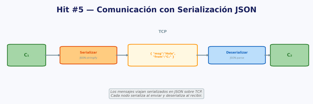

DEO GLORIA

# TP I HIT 5

## Descripción

Este proyecto implementa una comunicación TCP simple entre dos procesos (nodos) usando JSON para serializar los mensajes.

Cada nodo ejecuta en paralelo:

- **Servidor TCP** que escucha conexiones entrantes en un puerto definido por el usuario.
- **Cliente TCP** que se conecta al otro nodo y envía un saludo en formato JSON.

Una vez establecida la conexión, el nodo receptor responde con otro mensaje JSON.


## Diagrama de Arquitectura (DA)



---

## Requisitos

1. Python **3.12** (usa `socket`, `json`, `threading`).
2. Dos terminales (o un IDE que permita ejecutar dos instancias al mismo tiempo).
3. Puertos libres en rango no reservado (por ejemplo, > 1024).

---

## Ejecución

1. Abra una terminal y vaya al directorio donde está `C.py`.
2. Ejecute el script con 4 argumentos:  
   `mi_ip mi_puerto otro_ip otro_puerto`

   - `mi_ip` y `mi_puerto`: donde este nodo levantará su servidor.
   - `otro_ip` y `otro_puerto`: donde este nodo intentará conectarse.

Ejemplo (1° terminal):
```bash
python C.py 127.0.0.1 5000 127.0.0.1 5001
```

Ejemplo (2° terminal):
```bash
python C.py 127.0.0.1 5001 127.0.0.1 5000
```

> Nota: el cliente del nodo intentará reconectarse cada 2 segundos hasta lograr establecer la conexión.

---
---

## Funcionamiento (comportamiento del programa)

- El servidor acepta conexiones entrantes y responde con un JSON de tipo `saludo_respuesta`.
- El cliente se conecta al otro nodo, envía un JSON `saludo` y espera la respuesta.
- El cliente realiza un único intercambio y luego se cierra, pero el servidor sigue escuchando indefinidamente.

### Mensajes

#### Saludo (cliente → servidor)
```json
{
  "tipo": "saludo",
  "origen": <puerto>,
  "mensaje": "Hola nodo vecino"
}
```

#### Respuesta (servidor → cliente)
```json
{
  "tipo": "saludo_respuesta",
  "origen": <puerto>,
  "mensaje": "Hola desde servidor"
}
```

---
## Decisiones de diseño importantes

- **JSON** se utiliza para serializar/deserializar mensajes sobre TCP.
- El sistema permite elegir el puerto que usará cada nodo.
- El cliente reintenta la conexión cada 2 segundos si no puede conectarse.
- El programa no valida los argumentos de entrada; si faltan, fallará con un error.
- No se maneja explícitamente JSON inválido (el programa fallará si recibe datos no JSON).

---

## Observaciones

- Para pruebas locales se puede usar `127.0.0.1` en ambos nodos con puertos distintos.
- No use puertos reservados (menores a 1024) a menos que tenga permisos de administrador.

