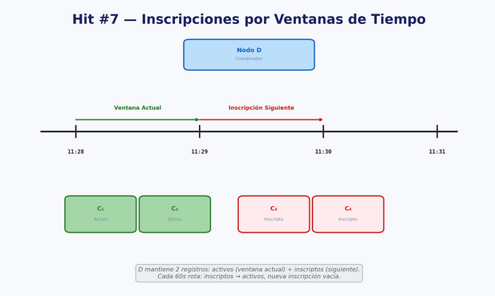

DEO GLORIA

# TP I HIT 7

## Descripción

Este proyecto implementa un sistema de **inscripción por ventanas de tiempo** donde múltiples nodos cliente (C) se registran en un nodo central (D) y solo pueden comunicarse durante ventanas de tiempo específicas.

El flujo es:
1. El nodo D (registro) mantiene dos listas: nodos "corriendo" (ventana actual) y nodos "próximos" (próxima ventana).
2. Cada nodo C se registra en D y se añade a la lista de nodos próximos.
3. Cada 60 segundos (en el minuto exacto), D rota: los nodos próximos pasan a ser corriendo, y se vacía la lista de próximos.
4. Durante su ventana activa, cada nodo C consulta periódicamente a D por la lista de vecinos.
5. Cada nodo C se conecta a sus vecinos activos y les envía saludos (TCP).

---
## Diagrama de Arquitectura (DA)



---

## Requisitos

1. Python **3.12** (usa `socket`, `http.server`, `json`, `threading`, `requests`, `time`).
2. Librería `requests` instalada (`pip install requests`).
3. Una o más terminales para ejecutar D y los nodos C.
4. Puertos libres: 8000 (para D) y puertos dinámicos para cada C.

---

## Componentes

### Nodo D (`D.py`) - Registro con ventanas de tiempo

Es un servidor HTTP que mantiene un registro de nodos activos y próximos, rotando entre ventanas cada minuto.

**Listas principales:**
- `nodos_corriendo`: nodos activos en la ventana actual (pueden comunicarse).
- `nodos_proximos`: nodos registrados para la próxima ventana.

**Endpoints:**

- **GET `/vecinos`**  
  Retorna los nodos en la ventana actual:
  ```json
  {
    "vecinos": [
      {"ip": "127.0.0.1", "port": 12345},
      {"ip": "127.0.0.1", "port": 54321}
    ]
  }
  ```

- **GET `/health`**  
  Retorna el estado del registro:
  ```json
  {
    "estado": "ok",
    "nodos_corriendo": <cantidad>,
    "nodos_proximos": <cantidad>
  }
  ```

- **POST `/registro`**  
  Registra un nuevo nodo. Recibe:
  ```json
  {
    "ip": "127.0.0.1",
    "port": 12345
  }
  ```
  
  Retorna confirmación (el nodo entra en `nodos_proximos`):
  ```json
  {
    "mensaje": "Nodo registrado para la próxima ventana"
  }
  ```

**Rotación de ventanas:**
- Cada 60 segundos (al cambio de minuto), D rota automáticamente.
- `nodos_corriendo` ← `nodos_proximos`
- `nodos_proximos` ← `[]` (se vacía)
- El estado se guarda en el archivo `estado_nodo.json`.

### Nodo C (`C.py`) - Cliente que se sincroniza con ventanas

Cada nodo C:
1. Se registra en D (se añade a `nodos_proximos`).
2. Consulta el endpoint `/vecinos` cada 10 segundos para obtener la lista de nodos en la ventana actual.
3. Para cada vecino en `nodos_corriendo`, intenta conectar y enviar un saludo TCP.
4. Ejecuta un servidor TCP para recibir saludos de otros nodos.

---

## Ejecución

### Paso 1: Iniciar el nodo D (registro con ventanas)

```bash
python D.py
```

Salida esperada:
```
Nodo D escuchando en puerto 8000
Nueva ventana iniciada
```

El nodo D rotará automáticamente cada 60 segundos.

### Paso 2: Iniciar múltiples nodos C

En terminales separadas (también en el directorio HIT7):

```bash
python C.py
```

Repetir en otras terminales para crear más nodos.

Ejemplo de salida:
```
Nodo C escuchando en 127.0.0.1 54321
Registrado para próxima ventana
Vecinos actuales: []
Vecinos actuales: [{"ip": "127.0.0.1", "port": 12345}]
Saludo enviado a {'ip': '127.0.0.1', 'port': 12345}
```

---

## Funcionamiento (comportamiento del programa)

### Línea de tiempo típica

Considere que D se inicia al minuto 1:00.

- **1:00 - 1:59 (Ventana 1)**  
  - C1 se registra → Va a `nodos_proximos`.
  - C1 consulta `/vecinos` → obtiene lista vacía (no hay nodos en `nodos_corriendo` aún).

- **1:59 - 2:00 (Rotación)**  
  - D rota: `nodos_corriendo` ← `[C1]`, `nodos_proximos` ← `[]`.
  - Imprime "Nueva ventana iniciada".

- **2:00 - 2:59 (Ventana 2)**  
  - C1 consulta `/vecinos` → obtiene lista vacía (C1 es el único).
  - C2 se registra → Va a `nodos_proximos`.
  - C2 consulta `/vecinos` → obtiene lista vacía (no está en `nodos_corriendo` aún).

- **2:59 - 3:00 (Rotación)**  
  - D rota: `nodos_corriendo` ← `[C2]`, `nodos_proximos` ← `[]`.

- **3:00 - 3:59 (Ventana 3)**  
  - C1 sigue consultando, pero ahora está en una ventana anterior (no es parte de `nodos_corriendo`).
  - C2 consulta `/vecinos` → obtiene `[C2]` (pero no hay otros nodos).
  - **Nota:** C1 y C2 no se comunican porque nunca están en la misma ventana activa.

### Flujo real (con alineación de tiempos)

Para que dos nodos se comuniquen, deben registrarse y esperar a la misma ventana:

```bash
# Terminal 1: D
python D.py

# Terminal 2: C1 (se registra en la ventana 1)
python C.py

# Terminal 3: C2 (se registra en la ventana 1)
python C.py
```

Si C1 y C2 se registran dentro del mismo minuto:
- A los 0 segundos del siguiente minuto, ambos pasan a `nodos_corriendo`.
- Ambos consultan `/vecinos` y obtienen el uno al otro.
- Se envían saludos mutuamente.

---

## Decisiones de diseño importantes

- **Ventanas de tiempo por minuto**: la rotación ocurre al cambio de minuto (cada 60 segundos).
- **Dos listas**: `nodos_corriendo` (activos ahora) y `nodos_proximos` (inscritos para después).
- **Consultaperiódica**: cada nodo C consulta cada 10 segundos para detectar cambios de ventana.
- **Persistencia**: el estado se guarda en `estado_nodo.json`.
- **Parámetros fijos**: D_IP y D_PORT en C.py están hardcodeados.
- **Manejo de errores limitado**: los `except` ignoran errores silenciosamente.

---

## Observaciones

- D debe iniciarse **antes** de los nodos C.
- Para que dos nodos C se comuniquen, deben registrarse en el **mismo minuto**.
- El intervalo de consulta en C (10 segundos) permite detectar cambios de ventana con cierto lag.
- `requests` es necesario para que C.py funcione.
- El archivo `estado_nodo.json` se genera automáticamente y persiste el estado de las listas.
- Dos nodos registrados en minutos diferentes nunca se verán (nunca estarán en la misma ventana activa).

