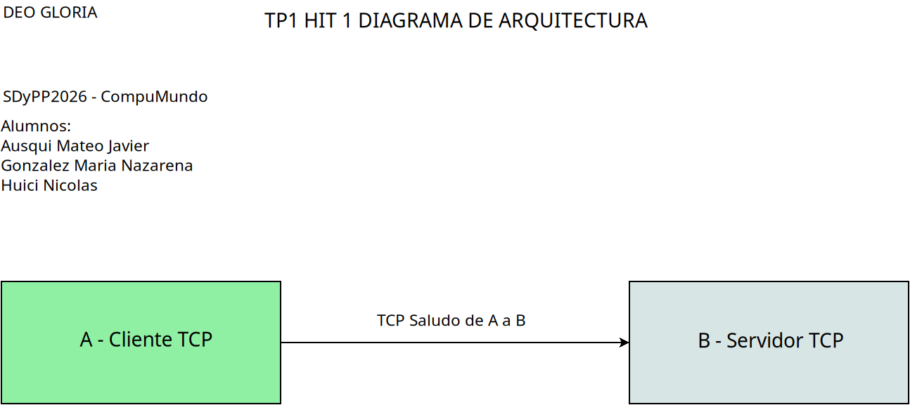

DEO GLORIA

# TP I HIT 1 README

## Diagrama de Arquitectura (DA)

## Requisitos

1. Python Version 3.12
2. Dos terminales que permitan ejecutar phyton o IDE que permita múltiples terminales

## Instrucciones de Ejecución

1. En una de las terminales posicionesé en la carpeta que tenga el archivo Hit1B.py
2. Ejecute la instrucción de su python instalado + el nombre del archivo mencionado en el paso anterior

Ejemplo en linux con python3:
> python3 Hit1B.py

3. En la segunda terminal posicionesé en la carpeta que tenga el archivo Hit1A.py
4. Símil al paso 2 pero con el archivo mencionado en el punto 3

Ejemplo en linux con python3:
> python3 Hit1A.py

## Decisiones de diseño

Mínimas requeridas por consigna, un cliente saluda a un servidor.
Solo detallamos la posibilidad de seleccionar puerto a utilizar por el servidor,
imposibilitando el usar puertos de uso reservado.
