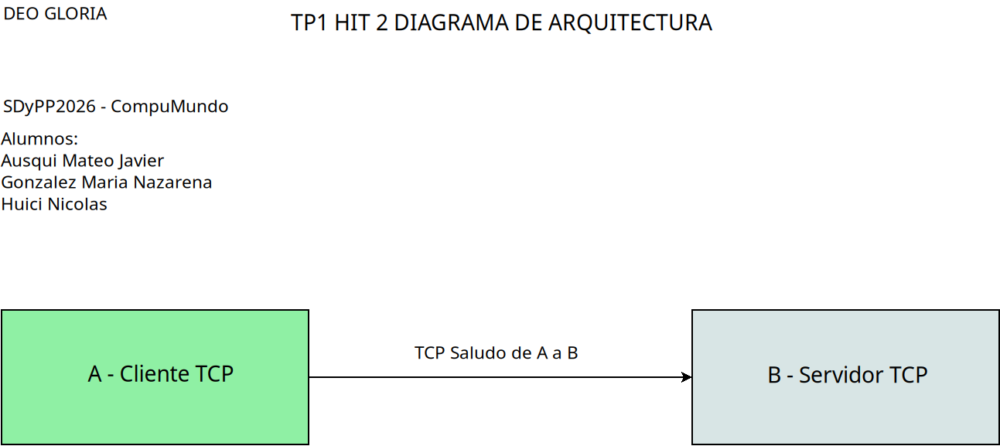

DEO GLORIA

# TP I HIT 2 README

## Diagrama de Arquitectura (DA)

## Requisitos

1. Python Version 3.12
2. Dos terminales que permitan ejecutar phyton o IDE que permita múltiples terminales

## Instrucciones de Ejecución

1. En una de las terminales posicionesé en la carpeta que tenga el archivo Hit2B.py
2. Ejecute la instrucción de su python instalado + el nombre del archivo mencionado en el paso anterior

Ejemplo en linux con python3:
> python3 Hit2B.py

3. En la segunda terminal posicionesé en la carpeta que tenga el archivo Hit2A.py
4. Símil al paso 2 pero con el archivo mencionado en el punto 3

Ejemplo en linux con python3:
> python3 Hit2A.py

## Decisiones de diseño

Mínimas requeridas por consigna, un cliente saluda a un servidor.
Imposibilitamos el usar puertos de uso reservado.
Misma arquitectura que TPI Hit 1, pero con distinta funcionalidad.

# Recomendaciones de prueba de uso

Ejecutar primero el servidor (B) y luego el cliente (A).
Notará que el servidor se cierra pero el cliente mantiene un bucle.
Intente conectarse sin activar el servidor.
Luego, intente una última vez volviendo a conectar el servidor.
Puede así ver que el cliente no deja de funcionar si el servidor está caído.
