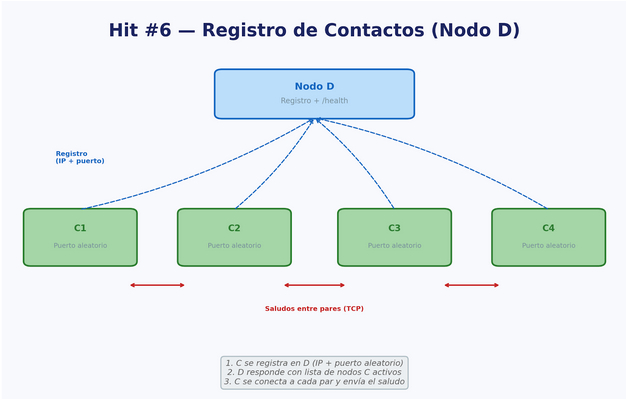

DEO GLORIA

-# TP I HIT 6

## Descripción

Este proyecto implementa un sistema de **registro centralizado de nodos** donde múltiples nodos cliente (C) se registran en un nodo central (D) y luego establecen comunicación directa entre sí.

El flujo es:
1. El nodo D (registro) se inicia primero y espera registro de nodos C.
2. Cada nodo C se registra en D, recibe la lista de otros nodos C activos.
3. Cada nodo C se conecta a sus vecinos y envía un saludo (TCP).
4. Los nodos C también escuchan en un puerto para recibir saludos de otros nodos.

---

## Diagrama de Arquitectura (DA)



---

## Requisitos

1. Python **3.12** (usa `socket`, `http.server`, `json`, `threading`, `requests`).
2. Librería `requests` instalada (`pip install requests`).
3. Una o más terminales para ejecutar D y los nodos C.
4. Puertos libres: 8000 (para D) y puertos dinámicos para cada C.

---

## Componentes

### Nodo D (`D.py`) - Registro centralizado

Es un servidor HTTP que mantiene un registro de todos los nodos C activos.

**Endpoints:**

- **GET `/health`**  
  Retorna el estado del registro:
  ```json
  {
    "estado": "ok",
    "nodos_registrados": <cantidad>,
    "tiempo_activo": <segundos>
  }
  ```

- **POST `/registro`**  
  Registra un nuevo nodo C. Recibe:
  ```json
  {
    "ip": "127.0.0.1",
    "port": 12345
  }
  ```
  
  Retorna la lista de vecinos (otros nodos C registrados):
  ```json
  {
    "vecinos": [
      {"ip": "127.0.0.1", "port": 54321},
      {"ip": "127.0.0.1", "port": 54322}
    ]
  }
  ```

### Nodo C (`C.py`) - Cliente que se registra y se comunica

Cada nodo C:
1. Se registra en D con su IP y puerto.
2. Recibe la lista de vecinos desde D.
3. Se conecta a cada vecino y envía un saludo TCP.
4. Ejecuta un servidor TCP para recibir saludos de otros nodos.

---

## Ejecución

### Paso 1: Iniciar el nodo D (registro)

```bash
python D.py nro_puerto
```

Salida esperada:
```
Nodo D escuchando en puerto nro_puerto
```

### Paso 2: Iniciar múltiples nodos C

En terminales separadas (también en el mismo directorio HIT6):

```bash
python C.py 127.0.0.1 nro_puerto 127.0.0.1
```

Repetir en otras terminales para crear más nodos. Cada nodo C se registrará en D, recibirá la lista de vecinos anteriores y enviará saludos a cada uno.

Salida esperada (cuando se inicia un nodo C):
```
Nodo C escuchando en 127.0.0.1 <puerto_dinamico>
Saludo enviado a {'ip': '127.0.0.1', 'port': <puerto_vecino>}
```

---

## Funcionamiento (comportamiento del programa)

### En el nodo D:
- Mantiene una lista global `nodos` con todos los registros.
- Cuando un nuevo nodo C se registra, D retorna la lista de nodos *previos* como vecinos.
- Cada nodo nuevo solo se conoce con los nodos que ya estaban registrados.

### En cada nodo C:
1. Se vincula a un puerto aleatorio (asignado por el SO).
2. Envía su información a D con una solicitud HTTP POST.
3. Recibe la lista de vecinos desde D.
4. Para cada vecino, intenta conectarse y envía un saludo TCP.
5. Ejecuta un servidor TCP en su puerto para recibir saludos de otros nodos.

### Formato del saludo (TCP entre nodos C):
```json
{
  "type": "saludo",
  "from": "127.0.0.1"
}
```

---

## Decisiones de diseño importantes

- **Separación de roles**: D es un registro HTTP centralizado; C son clientes que usan HTTP para registro y TCP para comunicación directa.
- **Puertos dinámicos para C**: cada nodo C obtiene un puerto del SO, evitando conflictos.
- **Vecinos iniciales**: cada nodo solo ve los nodos que ya estaban registrados cuando se registra.

